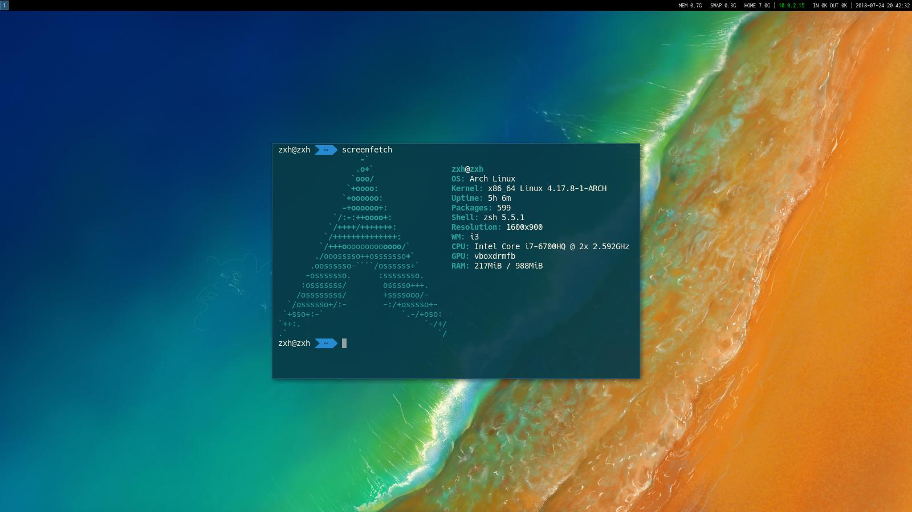
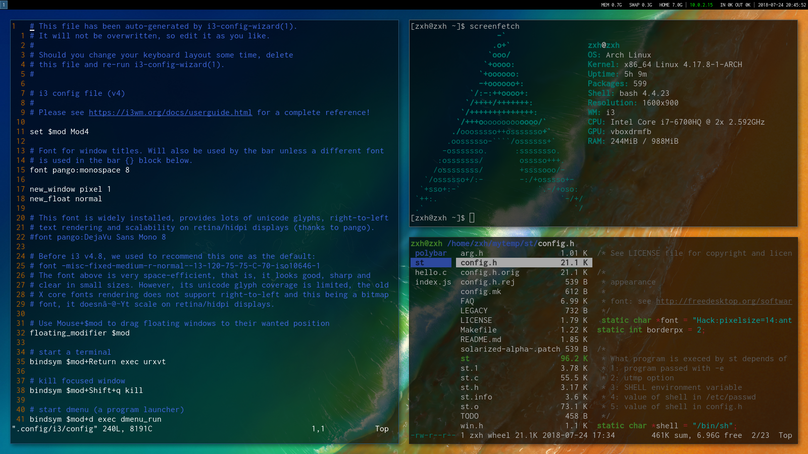

# 安装archlinux #

## 1 安装基本系统 ##

~~~
wget https://raw.githubusercontent.com/fankaljead/arch-install/master/basic/arch.sh
bash arch.sh
~~~

## 2 安装桌面环境 ##

~~~
wget https://raw.githubusercontent.com/fankaljead/arch-install/master/software/software.sh
bash software.sh
~~~

## 安装之后的截图 ##

